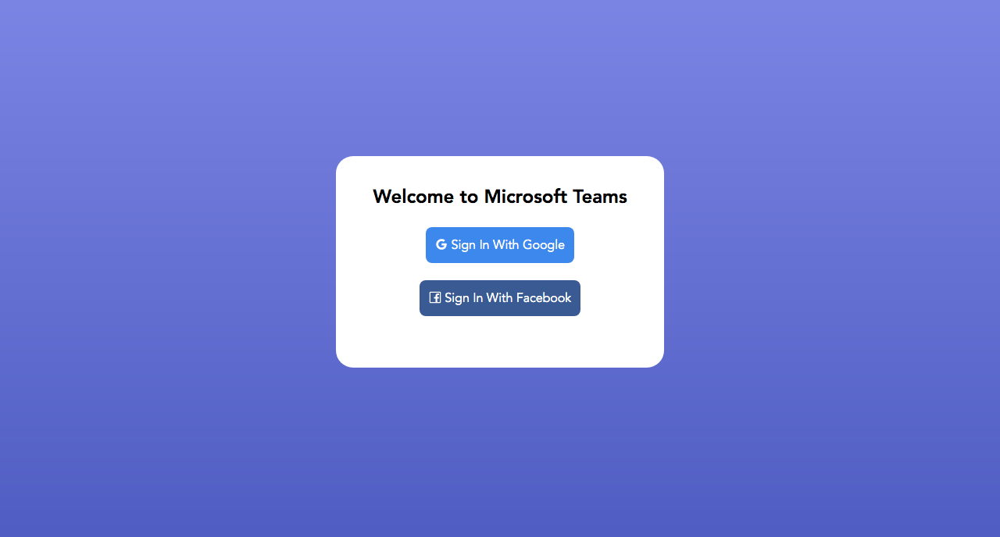
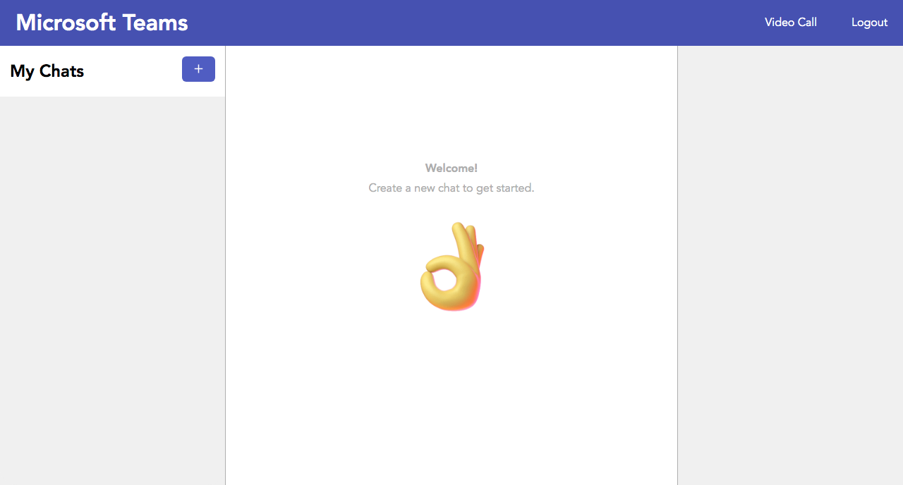
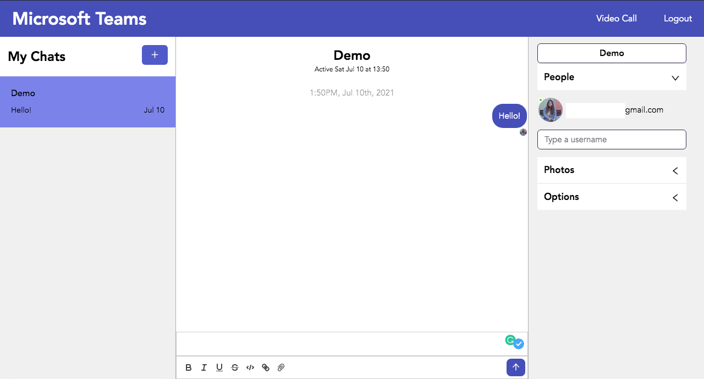
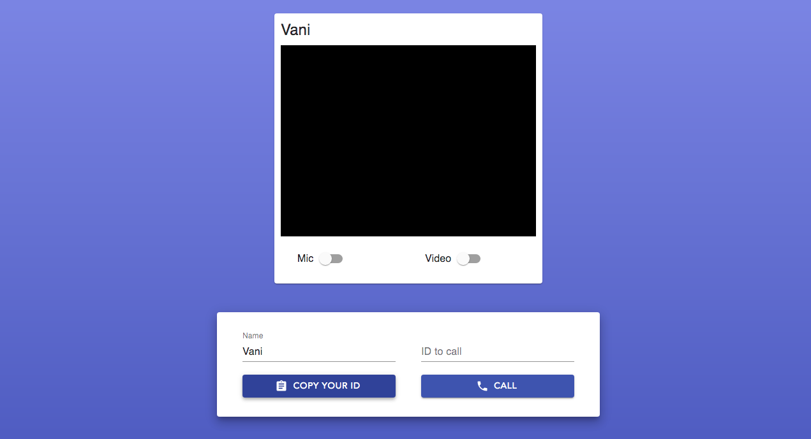
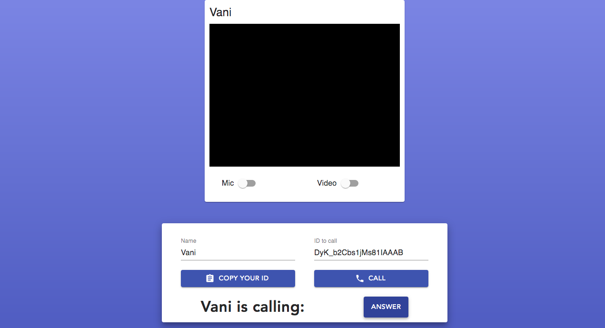
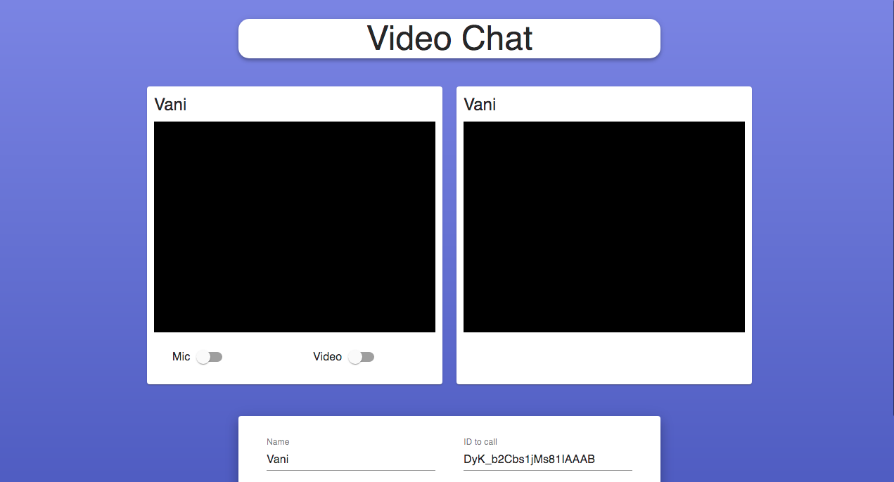

<h1 align="center">Microsoft Teams Clone 
  
</h1>

<p align="center">
 <a target="_blank" href="https://microsoft-teams-engage.netlify.app/">Link to the App</a>
    ·
 <a target="_blank" href="https://youtu.be/O7uGtnhZe2s">Video Demo</a>
</p>
    
<!-- TABLE OF CONTENTS -->
<details open="open">
  <summary>Table of Contents</summary>
  <ol>
    <li>
      <a href="#about-the-project">About The Project</a>
      <ul>
        <li><a href="#salient-features">Salient Features</a></li>
        <li><a href="#compatible-platforms">Compatible Platforms</a></li>
        <li><a href="#built-with">Built With</a></li>
      </ul>
    </li>
    <li>
      <a href="#agile-methodology">Agile Methodology</a>
      <ul>
        <li><a href="#what-is-agile">What is Agile</a></li>
        <li><a href="#how-i-incorporated-agile-methodology-during-the-development-cycle">How I Incorporated Agile Methodology During The Development Cycle</a></li>
      </ul>
    </li>
    <li>
      <a href="#getting-started">Getting Started</a>
      <ul>
        <li><a href="#prerequisites">Prerequisites</a></li>
        <li><a href="#installation">Installation</a></li>
      </ul>
    </li>
    <li><a href="#navigating-through-the-app">Navigating through the App</a></li><ul>
        <li><a href="#login">Login</a></li>
        <li><a href="#chat-window">Chat Window</a></li>
        <li><a href="#video-call">Video Call</a></li>
      </ul>
    <li><a href="#resources-used">Resources Used</a></li>
  </ol>
</details>

<!-- ABOUT THE PROJECT -->

## About The Project
* Microsoft Teams clone project built during Microsoft Engage 2021 program. 
* It is a video call and chat application through which we can chat before, during and after a video call. 
* The video call can take place between maximum 2 people at once.

### Salient Features
* User authentication using Firebase and login via Google and Facebook
* Creating and deleting chat groups, adding and removing people by the group admin, photo sharing, chat text formatting, read receipts, typing status of users
* One-on-one video call with randomly generated unique link and the ability to mute and unmute audio and video during the call

### Compatible Platforms
Laptops, Desktops and Tablet PCs

### Built With

### Video Call Application: 
* ![Front-end][front-end-shield]
* ![Back-end][back-end-shield]
* ![Tools][tools-shield]

### Chat Application: 
* ![Front-end][front-end-shield-1]
* ![Back-end][back-end-shield-1]
* ![Tools][tools-shield-1]

<!-- AGILE METHODOLOGY -->
## Agile Methodology

### What is Agile

Agile is a development methodology adopted today in the software industry. Agile promotes teamwork, flexible procedures, and sle-organizing teams.

### How I Incorporated Agile Methodology During The Development Cycle

SCRUM is a subset of Agile, a framework for developing software. SCRUM takes advantage of different techniques to achieve goals in Agile. SCRUM promotes an iterative model where the planning is performed on a very short term. The basic time working unit is the sprint. SCRUM teams always reason in sprints and their planning is limited to sprints.

* Sprint 1 (June 14): Sprint Planning, Research and Design - Researching about various video call libraries and SDKs that can be used to make a video call app with a minimum functionality to have a call between 2 people. After finalizing webRTC for making the video call app, I searched for tutorials, designed a wireframe including the functionalities I want and designed the UI.

* Sprint 2 (June 21): Software development and debugging - Started the development process by taking help from YouTube tutorials. Built a web application using React JS and Node JS for the first time. Encountered occasional bugs which I debugged timely. Made required changes in the UI and color scheme to make it more eye pleasing

* Sprint 3 (July 5): Adapting the surprise feature, debugging and adding additional features - My detailed research made it easy for me to decide how to implement the surprise 'adapt' feature. Decided to build a chat app using React JS and Chat Engine and link my previous video call application to the new chat application. Made changes in pre-loaded styles to complement the color scheme of the video call app and added sign in authentication using Firebase. Also added mute audio and video function in the video call application.

<!-- INSTALLATIONS -->

## Getting Started
To install and run the project on your local system, following are the requirements:
### Prerequisites
Make sure to install the required dependencies via node package manager
```sh
  npm install npm@latest -g
```
### Installation

* Video Call Application

To separately run the video call application on your local host, perform the following steps:

Run the following commands to start the server side.

```sh
  npm install && npm start
```
Run the following commands to start the client side and run it on your local host
```sh
  cd client
```
```sh
  npm install && npm start
```

* Chat Application

Run the following commands to start the application on your local host

```sh
  npm install && npm start
```
<!-- APP TUTORIAL-->
## Navigating Through The App
### Login

Login to the chat application via Google or Facebook. If an email id is linked with both Google and Facebook, then sign in can be done with wither via Google or Facebook.



### Chat Window

After logging in, a blank chat window appears. Start a new chat by clicking on the + sign. A video call can be placed by clicking the 'Video Call' option in the navigation bar. Adjacent to it is the logout option.



All the users registered with the app can be added to your chat. Photo sharing, read receipts, formatting the text, and many other things are possible in the chat. The shared photos can be viewed in the right pane. The chat can be deleted by expanding the 'Options' menu in the right pane and clicking the 'Delete' option.



### Video Call

The video call welcome screen shows your video and has a form to enter your name. To place a call, click on 'Copy your ID' and send the random generated unique ID to the person you want to call. 



The person who received the ID needs to copy that in the 'ID to call' input field and click on 'Call' button. You can accept the person's incoming call by clicking on 'Answer' button.



Once the call is accepted, the users are connected and can video call seamlessly with the option to mute audio and video when required. The call can be stopped by clicking on 'Hang Up' button. The video call screen closes and we are navigated back to the chat window.



<!-- ACKNOWLEDGEMENTS -->

## Resources Used

* [React video call app tutorial](https://youtu.be/oxFr7we3LC8)
* [How does webRTC work? Make a video call app using webRTC](https://youtu.be/rr_Zd16dql0)
* [Firebase chat app - React JS, Firebase, Chat Engine](https://youtu.be/Bv9Js3QLOLY)

<!--MARKDOWN LINKS-->
[front-end-shield]: https://img.shields.io/badge/Front--end-React%20JS%2C%20Material--UI-blueviolet
[back-end-shield]: https://img.shields.io/badge/Back--end-Node%20JS%2C%20Express%2C%20socket.io-blueviolet
[tools-shield]: https://img.shields.io/badge/Tools-Peer%20JS%2C%20webRTC-blueviolet
[front-end-shield-1]: https://img.shields.io/badge/Front--end-React%20JS%2C%20Ant--Design-blueviolet
[back-end-shield-1]: https://img.shields.io/badge/Back--end-Chat%20Engine-blueviolet
[tools-shield-1]: https://img.shields.io/badge/Tools-Firebase%2C%20Axios-blueviolet
